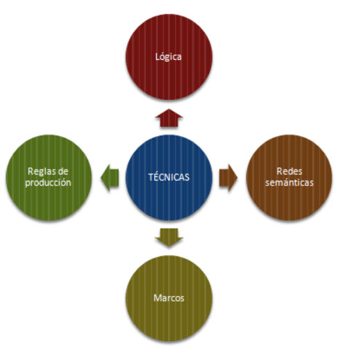
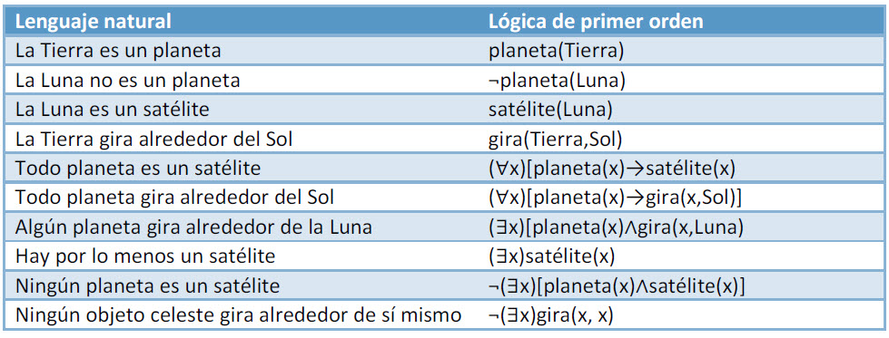
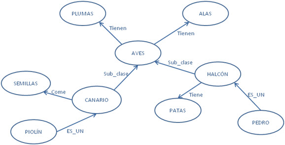
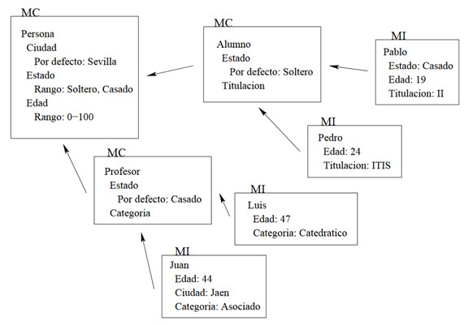
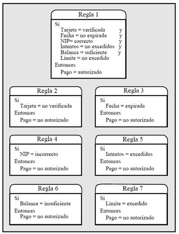

# TÉCNICAS DE REPRESENTACIÓN DEL CONOCIMIENTO EN INTELIGENCIA ARTIFICIAL

## Introducción
Representar el conocimiento en Inteligencia Artificial consiste en representar la información del mundo real para expresarlo en un lenguaje que pueda ser automatizado y se pueda utilizar para resolver problemas de la vida real.
Existen cuatro técnicas de representación del conocimiento que veremos a continuación.
<p align="center">
  
</p>

## Representación Lógica
Es un lenguaje que utiliza reglas definidas de tal forma que no existe ambigüedad en lo que se representa, utilizando proposiciones. Se aplican unas condiciones hasta llegar a la una conclusión. Cada proposición se traduce a la lógica utilizando reglas de comunicación definidas en sintaxis y semántica precisas:
**Sintaxis**, son las reglas que determinan
-	Cómo se construyen las frases.
-	Qué símbolos podemos usar.
-	Cómo se escriben esos símbolos.
**Semántica**, son reglas que nos permiten
-	Interpretar las sentencias.
-	Asignar un significado a cada sentencia.

#### Ventajas
-	Ayuda al razonamiento lógico
-	Es la base de los lenguajes de programación

#### Desventajas
-	En ocasiones es difícil modelar el lenguaje natural.
-	Genera inferencias que no son eficientes
Veamos un ejemplo de modelado:
<p align="center">
  
</p>

## Redes Semánticas
Es otra forma de representación del conocimiento que consiste en representarlo en forma de red gráfica, donde los nodos  son los objetos y los enlaces son las relaciones entre los objetos. 
Los nodos de una red semántica están unidos por los arcos, los cuales representan la relación conceptual que existen entre ellos. 
Existen varias categorías de redes semánticas: Redes IS-A, gráficos conceptuales y redes de marco. Veamos un ejemplo de Red IS-A. Representaremos el siguiente conocimiento:
```
-	Las aves tienen plumas y tienen alas.
-	El canario es un ave y come semillas.
-	Piolín es un canario
-	El halcón es un ave y tiene patas
-	Pedro es un Halcón
```
<p align="center">
  
</p>

#### Ventajas
-	Representación natural del conocimiento
-	Son muy potentes
-	Son simples y fáciles de comprender

#### Desventajas
-	Poca flexibilidad
-	No son inteligentes y dependen del creador
-	Requieren mucho tiempo de computación en tiempo de ejecución.
-	No es posible construir redes semánticas grandes

## Marcos
Un marco es un registro que contienen una colección de atributos y valores para describir una entidad. Divide el conocimiento en subestructuras. Se usan para representar conocimiento estereotipado o construido a  partir de experiencias reales.
Son una forma de expresar las redes semánticas. Cada nodo corresponde a un objeto que se convierte en un marco, que consta de una primera línea con el nombre del marco y una sucesión de líneas, llamadas ranuras (slots). Los marcos se relacionan unos con otros usando el concepto de herencia.
Hay dos tipos de marcos:
-	Clase: representan conceptos o situaciones genéricas. Se describen por propiedades.
-	Instancia: representan objetos concretos o individuos y están relacionados con un marco clase. Heredan las propiedades.
<p align="center">
  
</p>

#### Ventajas
-	Facilita la programación
-	Muy usado en IA por su flexibilidad.
-	Sintaxis consistente y fácil de leer
-	Facilidad para agregar nuevos atributos y relaciones.

#### Desventajas
-	Enfoque generalizado
-	El mecanismo de deducción puede no ajustarse de forma correcta a nuevas situaciones 
-	El mecanismo puede no ser procesado correctamente

## Reglas de producción
En este tipo de representación, el agente comprueba la condición y si ésta es cierta, se activa la regla correspondiente y se ejecuta la acción. La condición determina qué regla hay que cumplir y la parte de la acción lleva a cabo los pasos de la resolución del problema en cuestión. A este proceso completo se le conoce como "ciclo de reconocimiento-toma de decisión" (recognize-act cycle)
El sistema de reglas está formado por tres partes:
-	Conjunto de reglas de producción.
-	Memoria de trabajo.
-	Ciclo de reconocimiento-toma de decisión.
La siguiente figura muestra un ejemplo de las reglas de un sistema de cajero automático
 <p align="center">
  
</p>

#### Ventajas
-	Las regalas se pueden implementar en cualquier lenguajes
-	Muy fácil de representar en lógica
-	Modular, por que se pueden eliminar o modificar fácilmente.

#### Desventajas
-	No almacena el resultado del problema para usos futuros
-	Muy ineficiente en grandes sistemas
-	No presenta aprendizaje

## Bibliografía
- http://www.cs.us.es/~fsancho/?e=103
- http://roa.ult.edu.cu/bitstream/123456789/236/1/CAP2IA.pdf
- https://sitiointeligenciaa.wordpress.com/redes-semanticas/
- https://www.cs.us.es/~jalonso/cursos/li-03/temas/tema-6.pdf
- https://www.cs.us.es/cursos/ia2-2003/temas/tema-03.pdf
- http://dit.upm.es/~gfer/ssii/rcsi/rcsisu15.html
- https://freedoomforlife.wordpress.com/reglas/

